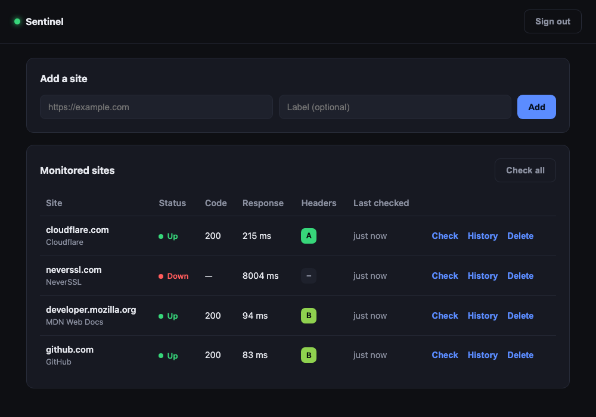

# Sentinel

Self-hosted uptime and HTTP security-header monitor. You register the URLs you
care about, and Sentinel checks whether each one is reachable, how fast it
responds, and how well it sets its HTTP security headers — storing every result
so you can see history over time.

Built as a zero-dependency Node.js service: the backend uses only the standard
library (`node:http`, `node:sqlite`, `node:crypto`, and the global `fetch`), with
a plain HTML/CSS/JavaScript dashboard on top.



## Features

- Uptime checks with status code and response time for each monitored site
- HTTP security-header audit (HSTS, CSP, X-Content-Type-Options, X-Frame-Options,
  Referrer-Policy, Permissions-Policy) scored to an A–F grade. Header *values* are
  validated, not just their presence — `max-age=0` HSTS or a bad `X-Frame-Options`
  earns no credit.
- Full check history per site, stored in SQLite (indexed on `site_id, ts`)
- Token-based sign-in (HMAC-signed, constant-time password check)
- Web dashboard to add sites, run checks, and browse history
- No runtime dependencies

## Security

Because Sentinel fetches user-supplied URLs, it is built to resist being misused:

- **SSRF protection** — before any fetch, the target is resolved and rejected if it
  points at a loopback, private, link-local, or otherwise reserved address (this
  blocks `localhost`, internal LANs, and cloud metadata at `169.254.169.254`). Only
  `http`/`https` schemes are allowed.
- **No insecure defaults** — the server refuses to start without `SENTINEL_PASSWORD`,
  and generates a random signing secret if none is provided.
- **Login rate limiting** — repeated failed logins from an address are throttled.
- **Request body size limit** — oversized payloads are rejected with `413`.
- **Security response headers** — Sentinel serves its own dashboard with
  `Content-Security-Policy`, `X-Frame-Options`, `X-Content-Type-Options`, and
  `Referrer-Policy`.

## Requirements

- Node.js 22.5 or newer (uses the built-in `node:sqlite` module)

## Setup

```bash
git clone https://github.com/rmayen/sentinel.git
cd sentinel
cp .env.example .env   # then set a password and secret
```

The defaults in `.env.example` are for local development only. Set
`SENTINEL_PASSWORD` and a long random `SENTINEL_SECRET` before exposing the
service anywhere.

## Run

```bash
npm start          # or: node --no-warnings src/server.js
```

Then open `http://localhost:3000` and sign in with your `SENTINEL_PASSWORD`.

## How the security grade works

Each check inspects the response headers for six common security headers. HSTS
and Content-Security-Policy are weighted more heavily because they carry the most
protection. The weighted score is mapped to a letter grade:

| Grade | Coverage |
| ----- | -------- |
| A | ≥ 90% |
| B | ≥ 75% |
| C | ≥ 50% |
| D | ≥ 25% |
| F | < 25% |

## API

All endpoints except `POST /api/login` require an `Authorization: Bearer <token>`
header.

| Method | Path | Description |
| ------ | ---- | ----------- |
| POST | `/api/login` | Exchange the password for a token |
| GET | `/api/sites` | List sites with their latest check |
| POST | `/api/sites` | Add a site (`{ "url", "label" }`) |
| DELETE | `/api/sites/:id` | Stop monitoring a site |
| POST | `/api/sites/:id/check` | Run a check now and store the result |
| GET | `/api/sites/:id/history` | List past checks for a site |

Example:

```bash
TOKEN=$(curl -s -XPOST localhost:3000/api/login \
  -d '{"password":"admin"}' | node -pe 'JSON.parse(require("fs").readFileSync(0)).token')

curl -s -XPOST localhost:3000/api/sites \
  -H "authorization: Bearer $TOKEN" \
  -d '{"url":"https://github.com","label":"GitHub"}'
```

## Tests

```bash
npm test
```

The suite covers the security-header grading and value validation, the token
sign/verify flow, the SSRF address checks, the database layer, and the HTTP API
end to end (auth, SSRF blocking on add, rate limiting, and body-size limits).

## Notes

- Checks are run on demand from the dashboard (or the API). Scheduling them on an
  interval — with `cron` or a small loop — is a natural next step.
- The SQLite file (`sentinel.db`) and `.env` are gitignored.
- The SSRF guard resolves the host and validates it before fetching. A fully
  robust deployment behind untrusted input would also pin the resolved address
  through the request to close the DNS-rebinding gap.
